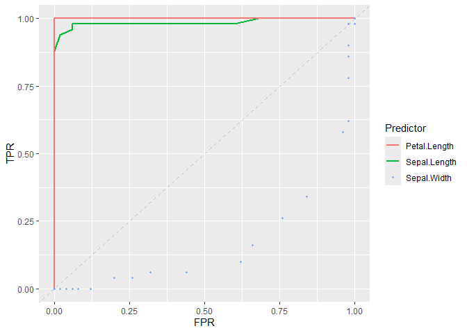

<!-- README.md is generated from README.Rmd. Please edit that file -->

# ROCnGO

<!-- badges: start -->

[](https://CRAN.R-project.org/package=ROCnGO)
[](https://app.codecov.io/gh/pabloPNC/ROCnGO?branch=master)
[](https://lifecycle.r-lib.org/articles/stages.html#experimental)
<!-- badges: end -->

## Overview

ROCnGO provides a set of tools to study a classifier performance by
using ROC curve based analysis. Package may address common challenges in
this type of analysis such as:

- Evaluating global classifier performance.
- Evaluating local classifier performance when a high specificity or
  sensitivity is required.
  - Implementation of indexes that provide a better interpretation of
    performance and discrimination power between classifier with similar
    performance.
- Evaluate performance on several classifier simultaneously.
- Plot whole, or relevant regions, of classifier ROC curves.

## Installation

Last version of ROCnGO can be installed from its
[GitHub](https://github.com/) repository with:

``` r
# install.packages("devtools")
devtools::install_github("pabloPNC/ROCnGO")
```

## Usage

``` r
library(ROCnGO)

# Iris subset
iris_subset <- iris[iris$Species != "versicolor",]

# Select Species = "virginica" as the condition of interest
iris_subset$Species <- relevel(iris_subset$Species, "virginica")

# Summarize a predictor over high sensitivity region
summarize_predictor(
  iris_subset,
  predictor = Sepal.Length,
  response = Species,
  threshold = 0.9,
  ratio = "tpr"
)
#> # A tibble: 1 × 5
#>     auc   pauc np_auc fp_auc curve_shape
#>   <dbl>  <dbl>  <dbl>  <dbl> <chr>      
#> 1 0.985 0.0847  0.847  0.852 Concave

# Summarize several predictors simultaneously
summarize_dataset(
  iris_subset,
  predictor = c(Sepal.Length, Sepal.Width, Petal.Length, Petal.Width),
  response = Species,
  threshold = 0.9,
  ratio = "tpr"
)
#> $data
#> # A tibble: 4 × 6
#>   identifier     auc   pauc np_auc fp_auc curve_shape      
#>   <chr>        <dbl>  <dbl>  <dbl>  <dbl> <chr>            
#> 1 Sepal.Length 0.985 0.0847 0.847   0.852 Concave          
#> 2 Sepal.Width  0.166 0.0016 0.0160  0.9   Hook under chance
#> 3 Petal.Length 1     0.1    1       1     Concave          
#> 4 Petal.Width  1     0.1    1       1     Concave          
#> 
#> $curve_shape
#> # A tibble: 2 × 2
#>   curve_shape       count
#>   <chr>             <int>
#> 1 Concave               3
#> 2 Hook under chance     1
#> 
#> $auc
#> # A tibble: 2 × 3
#> # Groups:   auc > 0.5 [2]
#>   `auc > 0.5` `auc > 0.8` count
#>   <lgl>       <lgl>       <int>
#> 1 FALSE       FALSE           1
#> 2 TRUE        TRUE            3

# Plot ROC curve of classifiers
plot_roc_curve(iris_subset, predictor = Sepal.Length, response = Species) +
  add_roc_curve(iris_subset, predictor = Petal.Length, response = Species) +
  add_roc_points(iris_subset, predictor = Sepal.Width, response = Species) +
  add_chance_line()
```


