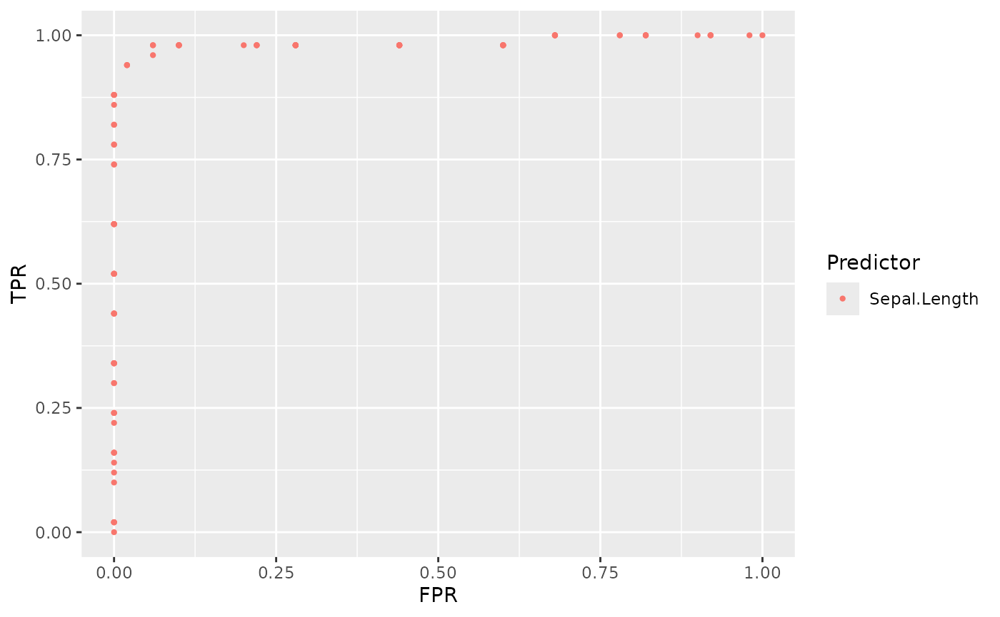
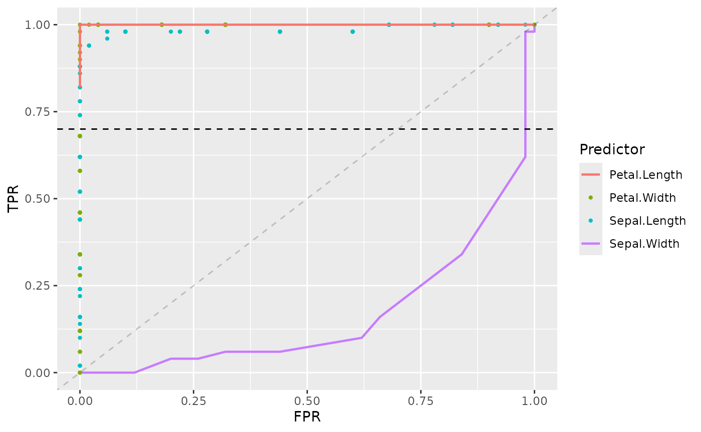

# Introduction to ROCnGO

ROCnGO is an R package which allows to analyze the performance of a
classifier by using receiver operating characteristic ($`ROC`$) curves.
Conventional $`ROC`$ based analyses just tend to use area under $`ROC`$
curve ($`AUC`$) as a metric of global performance, besides this
functionality, the package allows deeper analysis options by calculating
partial area under $`ROC`$ curve ($`pAUC`$) when prioritizing local
performance is preferred.

Furthermore, ROCnGO implements different $`pAUC`$ transformations
described in literature which:

- Make local performance interpretation easier.
- Allow to work with $`ROC`$ curves which are not completely concave or
  not at all (improper).
- Provide additional discrimination power when comparing classifiers
  with identical local performance (equal $`pAUC`$).

This document provides an introduction to ROCnGO tools and workflow to
study the global and local performance of a classifier.

## Prerequisites

In order to reproduce the example, following packages are needed:

``` r

library(ROCnGO)
library(dplyr)
library(forcats)
```

## Data

To explore basic tools in the package we will be using `iris` dataset.
The dataset contains 5 variables for 150 flowers of 3 different species:
*setosa*, *versicolor* and *virginica*.

For the purpose of simplicity, we will only work with a subset of
`iris`, considering only *setosa* and *virginica* species. In the
following sections, performance of different variables to classify cases
in the different species will be evaluated.

``` r

# Filter cases of versicolor species
iris_subset <- as_tibble(iris) %>% filter(Species != "versicolor")
iris_subset
#> # A tibble: 100 × 5
#>    Sepal.Length Sepal.Width Petal.Length Petal.Width Species
#>           <dbl>       <dbl>        <dbl>       <dbl> <fct>  
#>  1          5.1         3.5          1.4         0.2 setosa 
#>  2          4.9         3            1.4         0.2 setosa 
#>  3          4.7         3.2          1.3         0.2 setosa 
#>  4          4.6         3.1          1.5         0.2 setosa 
#>  5          5           3.6          1.4         0.2 setosa 
#>  6          5.4         3.9          1.7         0.4 setosa 
#>  7          4.6         3.4          1.4         0.3 setosa 
#>  8          5           3.4          1.5         0.2 setosa 
#>  9          4.4         2.9          1.4         0.2 setosa 
#> 10          4.9         3.1          1.5         0.1 setosa 
#> # ℹ 90 more rows
```

## Global performance

### Calculate ROC curve

The foundation of this type of analyses implies to plot the $`ROC`$
curve of a classifier. This type of curves represent a classifier
probability of correctly classify a case with a condition of interest,
also known as *true positive rate* or $`\text{Sensitivity}`$ ($`TPR`$),
and the complementary probability of correctly classify a case without
the condition; also known as *false positive rate*,
$`1 - \text{Specificity}`$, or $`1 - TNR`$, ($`FPR`$).

When working with a classifier that returns a series of numeric values,
it can be complex to say when it is classifying a case as having the
condition of interest (positive) or not (negative). To solve this
problem, $`ROC`$ curves represent $`(FPR, TPR)`$ points considering
hypothetical thresholds ($`c`$) where a case is considered as positive
if its value is higher than the defined threshold ($`X > c`$).

These curve points can be calculated by using
[`roc_points()`](https://pablopnc.github.io/ROCnGO/reference/roc_points.md).
As most functions in the package, it takes a dataset, a data frame, as
its first argument. The second and third argument refer to variables in
the data frame, corresponding the variable that will be used as a
classifier (`predictor`) and the response variable we want to predict
(`response`).

For example, we can calculate $`ROC`$ points for Sepal.Length as a
classifier of *setosa* species.

``` r

# Calculate ROC points for Sepal.Lenght
points <- roc_points(
  data = iris_subset,
  predictor = Sepal.Length,
  response = Species
)
points
#> # A tibble: 101 × 2
#>      tpr   fpr
#>  * <dbl> <dbl>
#>  1  1        1
#>  2  0.98     1
#>  3  0.92     1
#>  4  0.92     1
#>  5  0.92     1
#>  6  0.9      1
#>  7  0.82     1
#>  8  0.82     1
#>  9  0.82     1
#> 10  0.82     1
#> # ℹ 91 more rows

# Plot points
plot(points$fpr, points$tpr)
```


As we may see, Sepal.Length doesn’t perform very well predicting when a
flower is from setosa species, in fact it’s the other way around, the
lower the Sepal.Length the more probable to be working with a *setosa*
flower. This can be tested if we change the condition of interest to
*virginica*.

### Changing condition of interest

By default, condition of interest is automatically set to the first
value in `levels(response)`, so we can change this value by changing the
order of levels in data.

``` r

# Check response levels
levels(iris_subset$Species)
#> [1] "setosa"     "versicolor" "virginica"

# Set virginica as first value in levels
iris_subset$Species <- fct_relevel(iris_subset$Species, "virginica")
levels(iris_subset$Species)
#> [1] "virginica"  "setosa"     "versicolor"

# Plot ROC curve
points <- roc_points(
  data = iris_subset,
  predictor = Sepal.Length,
  response = Species
)
plot(points$fpr, points$tpr)
```


## Local performance

Sometimes a certain task may requiere prioritize e.g. high sensitivity
over global performance. In these scenarios, it’s preferable to work in
specific regions of $`ROC`$ curve.

We can calculate points in a specific region using
[`calc_partial_roc_points()`](https://pablopnc.github.io/ROCnGO/reference/calc_partial_roc_points.md).
Function uses same arguments as
[`roc_points()`](https://pablopnc.github.io/ROCnGO/reference/roc_points.md)
but adding `lower_threshold`, `upper_threshold` and `ratio`, which
delimit region in which we want to work.

For example, if we require to work in high sensitivity conditions, we
could check points in region $`(0.9, 1)`$ of $`TPR`$.

``` r

# Calc partial ROC points
p_points <- calc_partial_roc_points(
  data = iris_subset,
  predictor = Sepal.Length,
  response = Species,
  lower_threshold = 0.9,
  upper_threshold = 1,
  ratio = "tpr"
)
#> ℹ Upper threshold 1 already included in points.
#> • Skipping upper threshold interpolation
p_points
#> # A tibble: 54 × 2
#>      tpr     fpr
#>  * <dbl>   <dbl>
#>  1  0.9  0.00667
#>  2  0.94 0.02   
#>  3  0.94 0.02   
#>  4  0.94 0.02   
#>  5  0.96 0.06   
#>  6  0.98 0.06   
#>  7  0.98 0.06   
#>  8  0.98 0.1    
#>  9  0.98 0.1    
#> 10  0.98 0.1    
#> # ℹ 44 more rows

# Plot partial ROC curve
plot(p_points$fpr, p_points$tpr)
```


## Automating analysis

### Performance metrics

When working with a high number of classifiers, it can be difficult to
check each $`ROC`$ individually. In these scenarios, metrics such as
$`AUC`$ and $`pAUC`$ may present more interest. Thus, by using the
function
[`summarize_predictor()`](https://pablopnc.github.io/ROCnGO/reference/summarize_predictor.md)
we can obtain an overview of the performance of a classifier.

For example, we could consider the performance of Sepal.Length over a
high sensitivity region, $`TPR \in (0.9, 1)`$, and high specificity
region, $`FPR \in (0, 0.1)`$.

``` r

# Summarize predictor in high sens region
summarize_predictor(
  data = iris_subset,
  predictor = Sepal.Length,
  response = Species,
  threshold = 0.9,
  ratio = "tpr"
)
#> ℹ Upper threshold 1 already included in points.
#> • Skipping upper threshold interpolation
#> # A tibble: 1 × 6
#>     auc   pauc np_auc fp_auc ncp_auc curve_shape
#>   <dbl>  <dbl>  <dbl>  <dbl>   <dbl> <chr>      
#> 1 0.985 0.0847  0.847  0.852   0.973 Concave

# Summarize predictor in high spec region
summarize_predictor(
  data = iris_subset,
  predictor = Sepal.Length,
  response = Species,
  threshold = 0.1,
  ratio = "fpr"
)
#> ℹ Lower 0 and upper 0.1 thresholds already included in points
#> • Skipping lower and upper threshold interpolation
#> # A tibble: 1 × 6
#>     auc   pauc sp_auc tp_auc ncp_auc curve_shape
#>   <dbl>  <dbl>  <dbl>  <dbl>   <dbl> <chr>      
#> 1 0.985 0.0954  0.976  0.973   0.993 Concave
```

Besides $`AUC`$ and $`pAUC`$, function also returns other partial
indexes derived from $`pAUC`$ which provide a better interpretation of
performance than $`pAUC`$.

Furthermore, if we are interested in computing these metrics
simultaneously for several classifiers
[`summarize_dataset()`](https://pablopnc.github.io/ROCnGO/reference/summarize_dataset.md)
can be used, which also provides some metrics of analysed classifiers.

``` r

summarize_dataset(
  data = iris_subset,
  response = Species,
  threshold = 0.9,
  ratio = "tpr"
)
#> ℹ Lower 0.9 and upper 1 thresholds already included in points
#> • Skipping lower and upper threshold interpolation
#> $data
#> # A tibble: 4 × 7
#>   identifier     auc   pauc np_auc fp_auc ncp_auc curve_shape      
#>   <chr>        <dbl>  <dbl>  <dbl>  <dbl>   <dbl> <chr>            
#> 1 Sepal.Length 0.985 0.0847 0.847   0.852   0.973 Concave          
#> 2 Sepal.Width  0.166 0.0016 0.0160  0.9     0.177 Hook under chance
#> 3 Petal.Length 1     0.1    1       1       1     Concave          
#> 4 Petal.Width  1     0.1    1       1       1     Concave          
#> 
#> $curve_shape
#> # A tibble: 2 × 2
#>   curve_shape       count
#>   <chr>             <int>
#> 1 Concave               3
#> 2 Hook under chance     1
#> 
#> $auc
#> # A tibble: 2 × 3
#> # Groups:   auc > 0.5 [2]
#>   `auc > 0.5` `auc > 0.8` count
#>   <lgl>       <lgl>       <int>
#> 1 FALSE       FALSE           1
#> 2 TRUE        TRUE            3
```

### Plotting

As we have seen, by using the output of
[`roc_points()`](https://pablopnc.github.io/ROCnGO/reference/roc_points.md)
we can plot $`ROC`$ curve. Nevertheless, these plots can also be
generated using `plot_*()` and `add_*()` functions, which provide
further options to customize plot for classifier comparison.

For example, we can plot $`ROC`$ points of Sepal.Length in this way.

``` r

# Plot ROC points of Sepal.Length
sepal_length_plot <- plot_roc_points(
  data = iris_subset,
  predictor = Sepal.Length,
  response = Species
)
sepal_length_plot
#> Ignoring unknown labels:
#> • fill : "Bound"
```



Now by using `+` operator we can add further options to the plot. For
example, including chance line, adding further $`ROC`$ points of other
classifiers, etc.

``` r

sepal_length_plot +
  add_roc_curve(
    data = iris_subset,
    predictor = Sepal.Width,
    response = Species
  ) +
  add_roc_points(
    data = iris_subset,
    predictor = Petal.Width,
    response = Species
  ) +
  add_partial_roc_curve(
    data = iris_subset,
    predictor = Petal.Length,
    response = Species,
    ratio = "tpr",
    threshold = 0.7
  ) +
  add_threshold_line(
    threshold = 0.7,
    ratio = "tpr"
  ) +
  add_chance_line()
#> Ignoring unknown labels:
#> • fill : "Bound"
```


